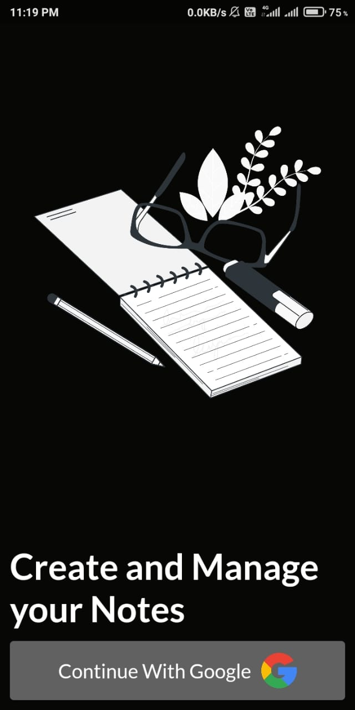
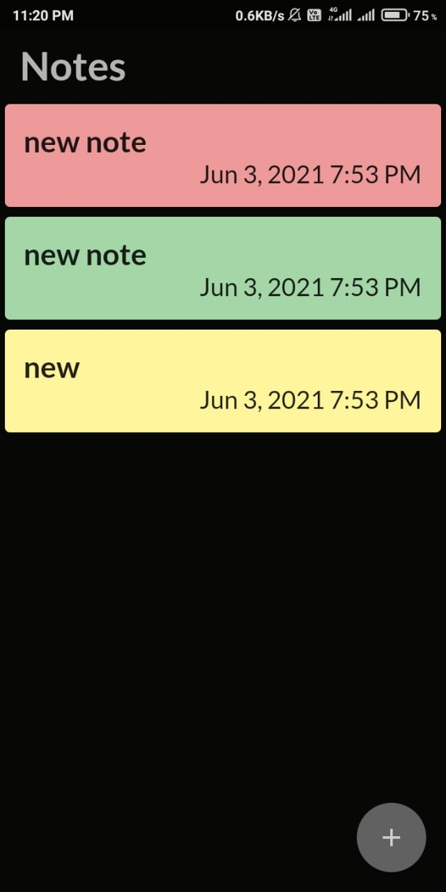
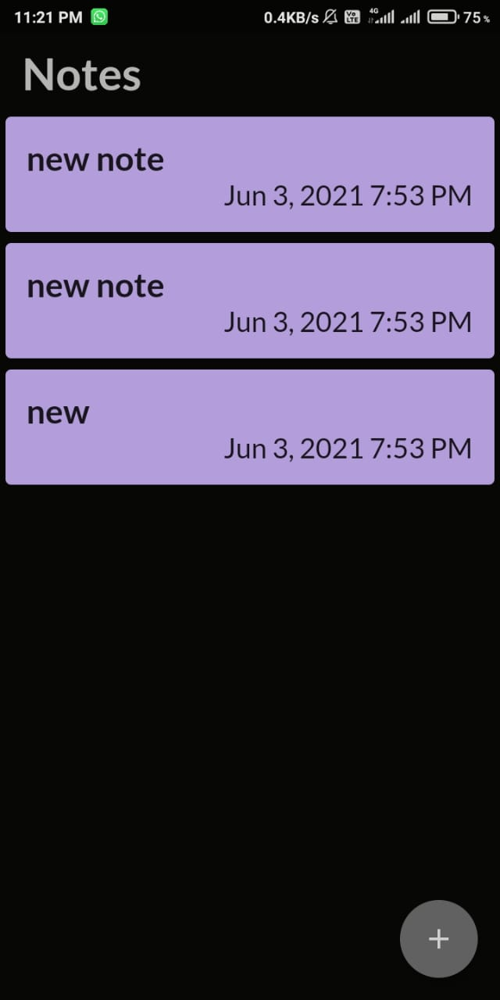
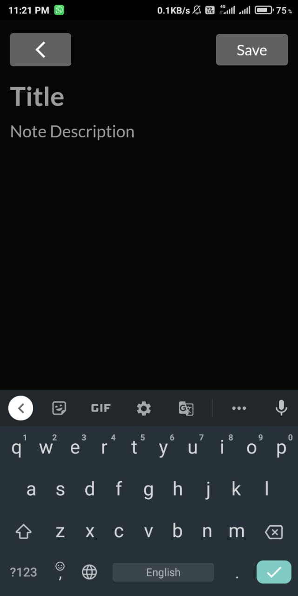

# **Flutter Notes Apk**

This is my first Flutter project.

---

Features I have added:

- Google login authentication
- Backend integrated with Firebase
- Save and Edit Notes
- Minimalistic UI

<h3>Authentication Page</h3>

<h3>Home Page</h3>

<h3>Save Notes</h3>

<h3>Edit Notes</h3>

